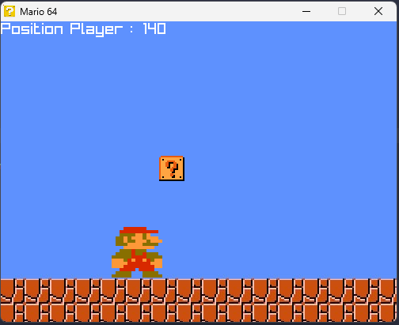
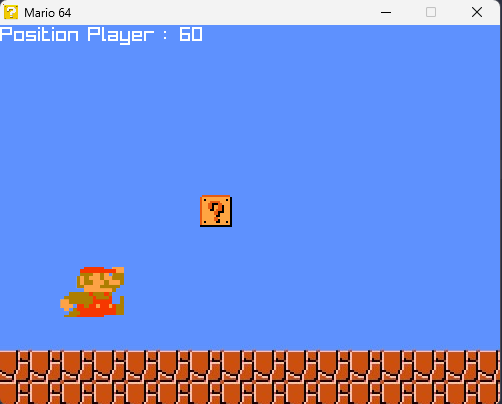
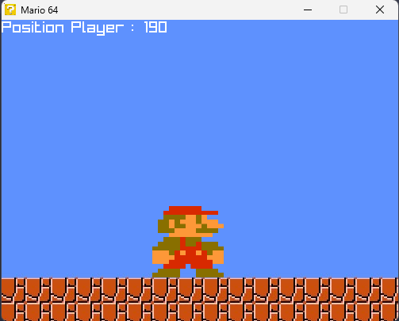

# 🍄 Mario 64

A small Mario-inspired game I'm making in **C with raylib**.

The project is mainly for learning C and getting familiar with raylib, especially textures, movement, collisions and basic game mechanics.

## Controls

* `Q` — Move left
* `D` — Move right
* `SPACE` — Jump

## What is currently in the game

* Player movement
* Jumping
* Player animation while jumping
* Left/right direction
* A block
* Mushroom
* Player size change after getting the mushroom
* Basic collision detection
* Background

<details>
<summary>📸 Screenshots</summary>

<br>

<p align="center">
  
  
</p>

<p align="center">
  
</p>

</details>

## Build

The project uses [raylib](https://www.raylib.com/).

Example with GCC:

```bash
gcc main.c -o mario64.exe -I"path/to/raylib/include" -L"path/to/raylib/lib" -lraylib
```

Then run:

```bash
./mario64.exe
```

## Project

I'm still working on it and adding things as I learn more about C and raylib.

This is basically a learning project, so the code is probably going to change quite a lot over time.
